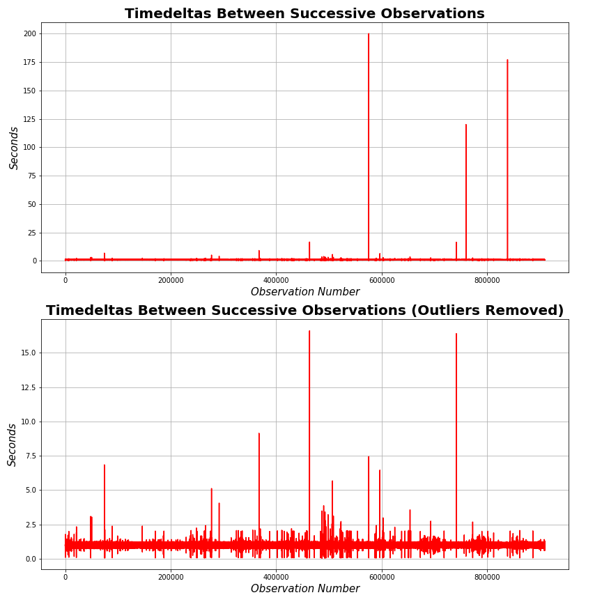
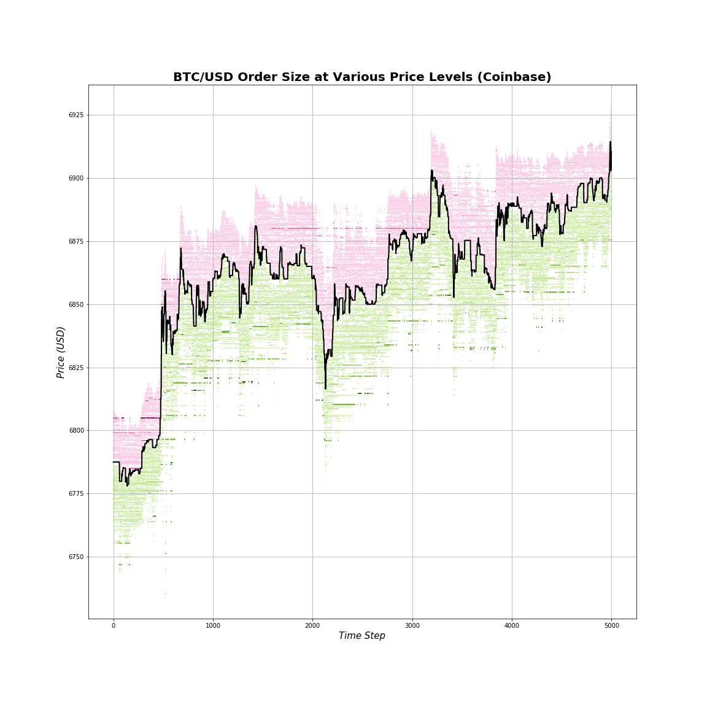

# Cryptocurrency HFT

## Data Collection
Price data is collected through the Coinbase public API approximately every second. We collect the level 2 order book aggregated into the top 50 bids and asks. The data is exported to CSV and zipped. The data can be found [here](./data). Below is a visualization of the timestamp deltas for the data over the collection period.

  

There are several pronounced spikes but based on [data quality checks](./data/Data_Quality_Checks.ipynb), only 0.128% of timedeltas are not within 0.3s from a 1s delta.

## Data Analysis
Below are various components of analysis conducted as part of this project. It is broken down into:
- [Data Visualization](./Order_Book_Visualization.ipynb)
- Data Clustering

#### Data Visualization
Below is a heatmap plot that indicates the size of BTC available to be traded over time at any given price. Green represents bids while purple represents asks. The darker the color, the more BTC is available at that price level. The order size values are mapped into a new range for easier plotting, so the color values are not directly interpretable.

  

  

#### Clustering of time series subsequences

## Model Development
LSTMs on each cluster identified in the prior step

## Trading Strategy Implementation
TBD
