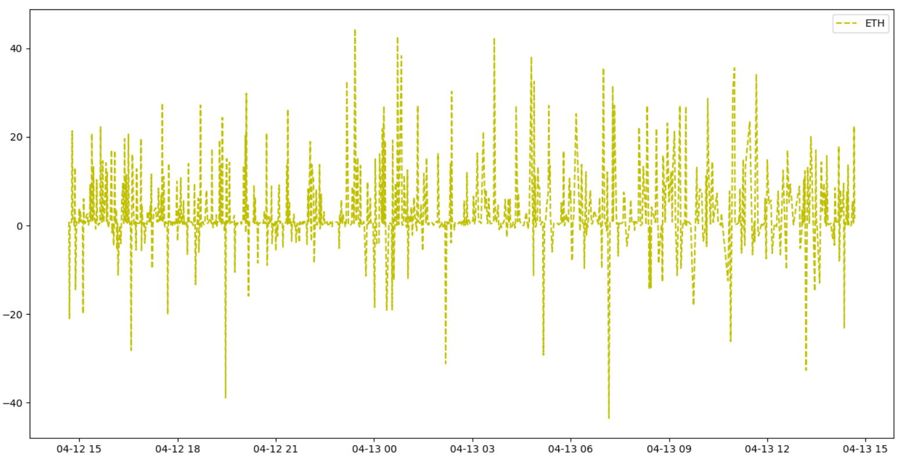

# Cryptocurrency HFT

## Data Collection
Price data is collected through the Coinbase public API approximately every second. We collect the level 2 order book aggregated into the top 50 bids and asks. The data is exported to CSV and zipped. The data can be found [here](./data). Below is a visualization of the timestamp deltas for the data over the collection period.

  

There are several pronounced spikes but based on [data quality checks](./data/Data_Quality_Checks.ipynb), only 0.128% of timedeltas are more than 0.3s away from a 1s target delta. These spikes occur for a variety of reasons like API issues, other processes running on the server that collects data, or really any other factor that increases latency.

Sentiment data is collected from the CryptoMood API once per minute and is based on VADER analysis of recent tweets, facebook posts, reddit threads, and telegram messages. The aggregate score is a weighted average of the approximate reach of each post, calculated from platform specific engagement metrics.

  

## Data Analysis
Below are various components of analysis conducted as part of this project. It is broken down into:
- [Data Visualization](./Order_Book_Visualization.ipynb)
- Data Clustering

### Data Visualization
Below is a heatmap plot that indicates the size of BTC available to be traded over time at any given price. Green represents bids while purple represents asks. The darker the color, the more BTC is available at that price level. The order size values are mapped into a new range for easier plotting, so the color values are not directly interpretable.

  

Here is another interesting visualization made with the help of matplotlib's animator. It shows how the cumulative order book evolves over time along with the price and spread of BTC. This animation in particular tracks the large price increase at the start of the graph above.

  

### Clustering of time series subsequences
Details on clustering to come

## Model Development
LSTMs on each cluster identified in the prior step

## Trading Strategy Implementation
TBD
